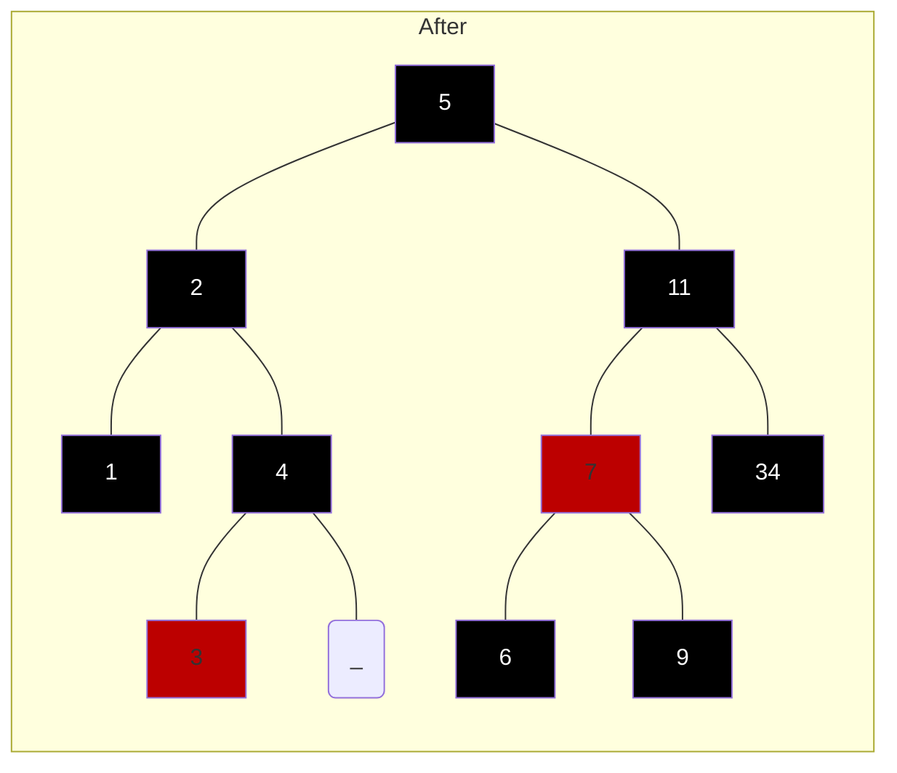

```mermaid
flowchart TB
subgraph Before
direction TB

1("7")
2("6")
3("9")
4("1")
5("34")
6("5")
7("11")
8("2")
9("3")
10("4")

1 --- 2 & 3
2 --- 4
2 --- 11("_")
4 --- 12("_")
4 --- 6
6 --- 8
6 --- 13("_")
8 --- 14("_")
8 --- 9
9 --- 15("_")
9 --- 10
3 --- 16("_")
3 --- 5
5 --- 7
5 --- 17("_")

style 1 fill:#000
style 2 fill:#bc0000
style 3 fill:#bc0000
style 4 fill:#bc0000
style 5 fill:#bc0000
style 6 fill:#bc0000
style 7 fill:#bc0000
style 8 fill:#bc0000
style 9 fill:#bc0000
style 10 fill:#bc0000
end
```

{7,6,9,1,5,2,3,4,34,11}
___
```
------RED->34
---------RED->11
---RED->9
BLACK->7
---RED->6
---------RED->5
------------------RED->4
---------------RED->3
------------RED->2
------RED->1
```

___
```
------BLACK->34
---BLACK->11
---------BLACK->9
------RED->7
---------BLACK->6
BLACK->5
------BLACK->4
---------RED->3
---BLACK->2
------BLACK->1
```
